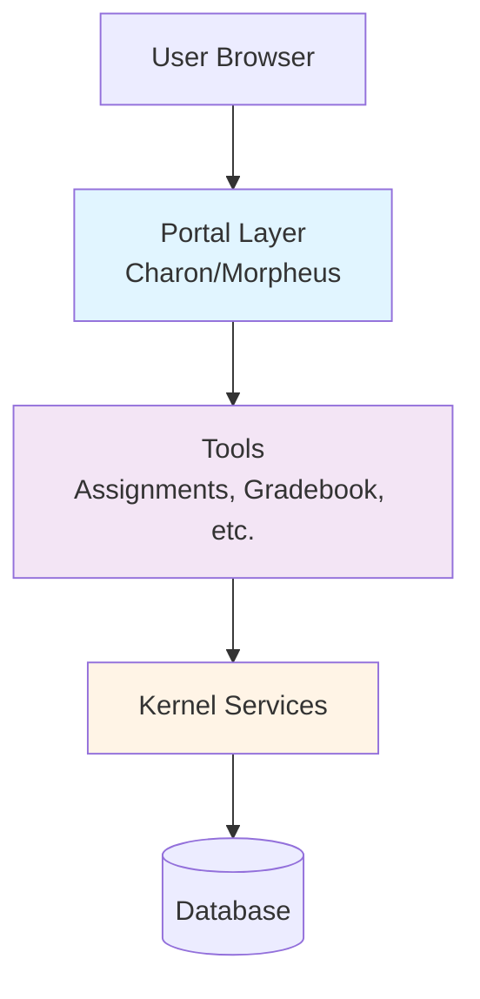

# System Architecture

Sakai LMS is built on a layered architecture that separates core services from presentation and tool functionality. This design enables modularity, extensibility, and maintainability across the platform.

## Architecture Layers

Sakai's architecture consists of three primary layers:

<CardGroup cols={3}>
  <Card title="Kernel Layer" icon="microchip">
    Core services and APIs that provide foundational functionality for all tools
  </Card>
  <Card title="Portal Layer" icon="browser">
    User interface framework that controls the outer UI and manages tool rendering
  </Card>
  <Card title="Tool Layer" icon="screwdriver-wrench">
    Individual applications (assignments, gradebook, etc.) that provide specific functionality
  </Card>
</CardGroup>

## High-Level Architecture Diagram



## Component Manager

At the heart of Sakai is the **Component Manager**, which uses Spring Framework to configure and wire service implementations.

<CodeGroup>

```java ComponentManager Interface
package org.sakaiproject.component.api;

public interface ComponentManager {
    /**
     * Find a component that is registered to provide this interface.
     */
    <T> T get(Class<T> iface);
    
    /**
     * Check if this interface Class has a registered component.
     */
    boolean contains(Class iface);
    
    /**
     * Get all interfaces registered in the component manager.
     */
    Set<String> getRegisteredInterfaces();
}
```

```java Using ComponentManager
// Access kernel services via ComponentManager
SiteService siteService = ComponentManager.get(SiteService.class);
UserDirectoryService userService = ComponentManager.get(UserDirectoryService.class);
ContentHostingService contentService = ComponentManager.get(ContentHostingService.class);
```

</CodeGroup>

<Note>
The Component Manager creates the Sakai Application Context, which serves as the parent Spring context for the entire platform. Services are configured using `components.xml` files in each module's `WEB-INF` directory.
</Note>

## Service Location Pattern

Sakai uses a service location pattern where tools access kernel services through the Component Manager rather than direct instantiation:

```java
// Correct: Use service location
SiteService siteService = ComponentManager.get(SiteService.class);
Site site = siteService.getSite(siteId);

// Incorrect: Don't instantiate services directly
// SiteService siteService = new SiteServiceImpl(); // WRONG!
```

## Key Architectural Principles

### 1. Separation of Concerns
- **Kernel**: Provides core services (user management, authorization, content hosting)
- **Portal**: Manages UI chrome, navigation, and tool rendering
- **Tools**: Implement specific educational features

### 2. API/Implementation Split

Each service is defined as:
- **API** (interface): Located in `kernel/api/src/main/java/org/sakaiproject/*/api/`
- **Implementation**: Located in `kernel/kernel-impl/src/main/java/org/sakaiproject/*/impl/`

Reference: [kernel/README.md:5-33](/home/daytona/workspace/source/kernel/README.md:5-33)

### 3. Spring-Based Dependency Injection

Services are wired using Spring XML configuration:

```xml
<!-- Example: site-components.xml -->
<bean id="org.sakaiproject.site.api.SiteService"
      class="org.sakaiproject.site.impl.SiteServiceImpl"
      init-method="init" destroy-method="destroy">
    <property name="sqlService" ref="org.sakaiproject.db.api.SqlService"/>
    <property name="entityManager" ref="org.sakaiproject.entity.api.EntityManager"/>
</bean>
```

## Portal Architecture

The portal layer controls the outer UI and manages how tools are rendered to users.

### Portal Components

<AccordionGroup>
  <Accordion title="SkinnableCharonPortal">
    Main portal implementation that handles requests and delegates to handlers
    
    Location: `portal/portal-impl/impl/src/java/org/sakaiproject/portal/charon/SkinnableCharonPortal.java`
  </Accordion>
  
  <Accordion title="Portal Handlers">
    Special URL handlers for different portal functions:
    - Direct tool access: `/portal/directtool/{tool-id}?sakai.site={site-id}`
    - Bug reports: `/portal/generatebugreport`
  </Accordion>
  
  <Accordion title="Render Engine">
    Manages tool rendering using templates (Morpheus theme)
    
    Module: `portal-render-engine-impl`
  </Accordion>
</AccordionGroup>

Reference: [portal/README.md:1-49](/home/daytona/workspace/source/portal/README.md:1-49)

## Entity Producer Pattern

Many kernel services implement the `EntityProducer` interface, which enables:
- Archive and merge functionality
- Import/export capabilities
- Consistent entity handling

```java
public interface EntityProducer {
    /**
     * @return a short string identifying the resources kept here
     */
    String getLabel();
    
    /**
     * @return true if the service wants to be part of archive/merge
     */
    boolean willArchiveMerge();
    
    /**
     * Archive the resources for the given site.
     */
    String archive(String siteId, Document doc, Stack<Element> stack, 
                   String archivePath, List<Reference> attachments);
}
```

Reference: [kernel/api/src/main/java/org/sakaiproject/entity/api/EntityProducer.java:37-76](/home/daytona/workspace/source/kernel/api/src/main/java/org/sakaiproject/entity/api/EntityProducer.java:37-76)

<Info>
Services like `SiteService`, `UserDirectoryService`, `ContentHostingService`, and `AuthzGroupService` all implement `EntityProducer`, enabling consistent site import/export functionality.
</Info>

## Technology Stack

- **Backend Framework**: Spring Framework (dependency injection, MVC)
- **ORM**: Hibernate (for database persistence)
- **Template Engine**: Thymeleaf (preferred for new development)
- **Frontend**: Web Components using Lit library, Bootstrap 5.2
- **Java Version**: Java 17 (trunk), Java 11 (Sakai 22/23)

## Module Structure

Typical Sakai module structure:

```
module-name/
├── api/              # Service interfaces
├── impl/             # Service implementations
│   └── src/main/webapp/WEB-INF/
│       └── components.xml
├── tool/             # Web application (UI)
└── pom.xml
```

Reference: [source/assignment/](/home/daytona/workspace/source/assignment/)

## Next Steps

<CardGroup cols={2}>
  <Card title="Kernel Services" href="/concepts/kernel" icon="server">
    Learn about core kernel services and APIs
  </Card>
  <Card title="Tool Architecture" href="/concepts/tools" icon="wrench">
    Understand how tools are structured
  </Card>
  <Card title="Sites & Workspaces" href="/concepts/sites-and-workspaces" icon="sitemap">
    Explore site and workspace concepts
  </Card>
</CardGroup>
