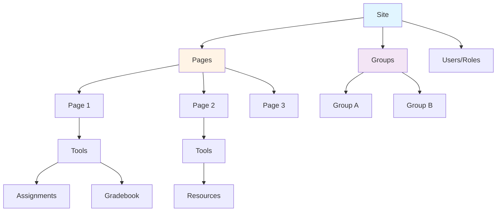

# Sites and Workspaces

Sites are the fundamental organizational unit in Sakai. A site is a workspace that contains pages, tools, and users with specific roles and permissions.

## What is a Site?

A **site** is a workspace that:

- Contains **pages** (tabs in the navigation)
- Has **tools** placed on pages
- Has **users** with specific **roles**
- Defines **permissions** for what users can do
- Can have **groups** for organizing subsets of users

<Info>
In Sakai terminology, "site" and "workspace" are often used interchangeably. A site is essentially a container for organizing tools, users, and content.
</Info>

## Site Types

Sakai supports different types of sites:

<CardGroup cols={3}>
  <Card title="Course Sites" icon="graduation-cap">
    Academic course workspaces with roster integration
  </Card>
  <Card title="Project Sites" icon="diagram-project">
    Collaboration spaces for projects or groups
  </Card>
  <Card title="My Workspace" icon="house">
    Personal workspace for each user
  </Card>
</CardGroup>

## Site Interface

The `Site` interface represents a Sakai site:

<CodeGroup>

```java Site Interface
package org.sakaiproject.site.api;

/**
 * Site is the object that knows the information, tools and 
 * layouts for a Sakai Site.
 */
public interface Site extends Edit, Comparable, Serializable, AuthzGroup {
    
    // Property names
    public static final String PROP_SITE_CONTACT_EMAIL = "contact-email";
    public static final String PROP_SITE_CONTACT_NAME = "contact-name";
    public static final String PROP_SITE_TERM = "term";
    public static final String PROP_SITE_TERM_EID = "term_eid";
    public static final String PROP_SITE_LANGUAGE = "locale_string";
    
    /**
     * @return the user who created this.
     */
    User getCreatedBy();
    
    /**
     * @return the user who last modified this.
     */
    User getModifiedBy();
}
```

```java Working with Sites
// Get the SiteService
SiteService siteService = ComponentManager.get(SiteService.class);

// Get a site by ID
Site site = siteService.getSite(siteId);

// Get site properties
String title = site.getTitle();
String description = site.getDescription();
String type = site.getType();
boolean isPublished = site.isPublished();

// Get site contact information
String contactName = site.getProperties()
    .getProperty(Site.PROP_SITE_CONTACT_NAME);
String contactEmail = site.getProperties()
    .getProperty(Site.PROP_SITE_CONTACT_EMAIL);

// Get pages in the site
List<SitePage> pages = site.getPages();

// Get ordered pages
List<SitePage> orderedPages = site.getOrderedPages();
```

</CodeGroup>

Reference: [kernel/api/src/main/java/org/sakaiproject/site/api/Site.java:35-100](/home/daytona/workspace/source/kernel/api/src/main/java/org/sakaiproject/site/api/Site.java:35-100)

## Site Hierarchy

Sites have a hierarchical structure:



## Pages

Pages are the tabs that appear in a site's navigation. Each page can contain one or more tools.

```java
// Get site pages
List<SitePage> pages = site.getPages();

for (SitePage page : pages) {
    // Get page properties
    String pageId = page.getId();
    String pageTitle = page.getTitle();
    int position = page.getPosition();
    
    // Get tools on this page
    List<ToolConfiguration> tools = page.getTools();
    
    for (ToolConfiguration tool : tools) {
        String toolId = tool.getToolId();
        String toolTitle = tool.getTitle();
        
        // Get tool configuration
        Properties config = tool.getConfig();
    }
}
```

<Note>
Pages are ordered. Use `getOrderedPages()` to get pages in their display order, or `page.getPosition()` to get a specific page's position.
</Note>

## Tool Placements

A **tool placement** (or **tool configuration**) is an instance of a tool on a page. The same tool can be placed multiple times with different configurations.

```java
// Get a specific tool placement
ToolConfiguration toolConfig = page.getTool(placementId);

// Tool placement properties
String placementId = toolConfig.getId();
String toolId = toolConfig.getToolId();  // e.g., "sakai.assignment.grades"
String title = toolConfig.getTitle();
String layoutHints = toolConfig.getLayoutHints();

// Get placement configuration
Properties config = toolConfig.getConfig();
String customProperty = config.getProperty("custom.setting");

// Get the site context
String siteId = toolConfig.getContext();
```

### Tool Configuration Properties

Tool placements can have custom configuration:

```java
// Set tool configuration
Properties config = toolConfig.getPlacementConfig();
config.setProperty("display.users", "true");
config.setProperty("max.items", "20");
```

## Groups

Groups organize subsets of users within a site. Groups can have their own permissions and can be used to restrict access to tools or resources.

```java
// Get site groups
Collection<Group> groups = site.getGroups();

for (Group group : groups) {
    String groupId = group.getId();
    String groupTitle = group.getTitle();
    String groupDescription = group.getDescription();
    
    // Get group members
    Set<Member> members = group.getMembers();
    
    // Get group properties
    ResourceProperties props = group.getProperties();
}

// Get a specific group
Group group = site.getGroup(groupId);

// Create a new group
Group newGroup = site.addGroup();
newGroup.setTitle("Study Group A");
newGroup.setDescription("Monday study session");
```

<Info>
Groups are particularly useful for:
- Breaking a large class into sections
- Creating project teams
- Organizing discussion or assignment groups
- Restricting access to specific resources
</Info>

## SiteService Operations

The `SiteService` provides comprehensive site management:

<CodeGroup>

```java Querying Sites
SiteService siteService = ComponentManager.get(SiteService.class);

// Get current site
String currentSiteId = ToolManager.getCurrentPlacement().getContext();
Site currentSite = siteService.getSite(currentSiteId);

// Check if site exists
boolean exists = siteService.siteExists(siteId);

// Get user's sites
List<Site> userSites = siteService.getUserSites();

// Get sites of a specific type
List<Site> courseSites = siteService.getSites(
    SelectionType.ANY,     // selection type
    "course",              // site type
    null,                  // search term
    null,                  // properties
    SortType.TITLE_ASC,    // sort order
    null                   // paging
);
```

```java Creating Sites
// Create a new site
Site site = siteService.addSite(siteId, "course");

// Set site properties
site.setTitle("Introduction to Computer Science");
site.setDescription("CS 101 - Fall 2026");
site.setShortDescription("CS 101");
site.setPublished(true);

// Set contact info
ResourcePropertiesEdit props = site.getPropertiesEdit();
props.addProperty(Site.PROP_SITE_CONTACT_NAME, "Dr. Smith");
props.addProperty(Site.PROP_SITE_CONTACT_EMAIL, "smith@university.edu");

// Add a page
SitePage page = site.addPage();
page.setTitle("Assignments");
page.setLayout(SitePage.LAYOUT_SINGLE_COL);

// Add a tool to the page
ToolConfiguration tool = page.addTool();
tool.setTool("sakai.assignment.grades", 
             ToolManager.getTool("sakai.assignment.grades"));
tool.setTitle("Assignments");

// Save the site
siteService.save(site);
```

```java Modifying Sites
// Get site for editing
Site site = siteService.getSite(siteId);

// Modify site properties
site.setTitle("Updated Title");
site.setDescription("New description");

// Add a new page
SitePage newPage = site.addPage();
newPage.setTitle("Resources");

// Remove a page
site.removePage(pageToRemove);

// Save changes
siteService.save(site);
```

```java Deleting Sites
// Remove a site
siteService.removeSite(site);

// Soft delete (can be recovered)
siteService.softDeleteSite(siteId);
```

</CodeGroup>

## Site Events

SiteService posts events for important operations:

| Event | Description |
|-------|-------------|
| `site.visit` | User visits a site |
| `site.visit.unp` | User visits an unpublished site |
| `site.add` | Site is created |
| `site.add.course` | Course site is created |
| `site.add.project` | Project site is created |
| `site.upd` | Site is updated |
| `site.del` | Site is deleted |
| `site.del.soft` | Site is soft-deleted |

Reference: [kernel/api/src/main/java/org/sakaiproject/site/api/SiteService.java:67-100](/home/daytona/workspace/source/kernel/api/src/main/java/org/sakaiproject/site/api/SiteService.java:67-100)

## Authorization in Sites

Sites implement the `AuthzGroup` interface, which means they define:

- **Roles**: Named sets of permissions (e.g., "Instructor", "Student")
- **Users**: Members with assigned roles
- **Permissions**: What each role can do

```java
// Site implements AuthzGroup
AuthzGroup siteRealm = site;

// Get user's role in site
Role userRole = siteRealm.getUserRole(userId);

// Check if user has permission
boolean canEdit = siteRealm.isAllowed(userId, "site.upd");

// Get all members
Set<Member> members = siteRealm.getMembers();

// Get users with a specific role
Set<Member> instructors = siteRealm.getUsersHasRole("Instructor");
```

<Warning>
Always use `AuthzGroupService` or the site's authorization methods to check permissions. Never implement your own authorization logic.
</Warning>

## Site Properties

Sites can have custom properties stored as name-value pairs:

```java
// Get site properties
ResourceProperties props = site.getProperties();

// Get standard properties
String contactName = props.getProperty(Site.PROP_SITE_CONTACT_NAME);
String contactEmail = props.getProperty(Site.PROP_SITE_CONTACT_EMAIL);
String term = props.getProperty(Site.PROP_SITE_TERM);
String language = props.getProperty(Site.PROP_SITE_LANGUAGE);

// Get custom properties
String customProp = props.getProperty("institution.dept.code");

// Set properties (when editing)
ResourcePropertiesEdit propsEdit = site.getPropertiesEdit();
propsEdit.addProperty("custom.property", "value");
```

## My Workspace

Each user has a personal workspace (My Workspace) with site ID in the format `~{userId}`:

```java
// Get current user's workspace
String userId = SessionManager.getCurrentSessionUserId();
String workspaceId = siteService.getUserSiteId(userId);
// workspaceId will be "~userid"

Site workspace = siteService.getSite(workspaceId);

// Alternative: Get user site directly
Site userSite = siteService.getSiteUserId(userId);
```

## Best Practices

<AccordionGroup>
  <Accordion title="Always Check Site Access">
    Before accessing a site, verify the user has permission:
    
    ```java
    // Check if user can access site
    if (!siteService.allowAccessSite(siteId)) {
        throw new PermissionException(userId, "site.visit", siteId);
    }
    
    Site site = siteService.getSite(siteId);
    ```
  </Accordion>
  
  <Accordion title="Use Site Context in Tools">
    Tools should always operate within the context of the current site:
    
    ```java
    // Get current site context
    String siteId = ToolManager.getCurrentPlacement().getContext();
    Site site = siteService.getSite(siteId);
    
    // Don't hardcode site IDs
    // Site site = siteService.getSite("abc123"); // WRONG!
    ```
  </Accordion>
  
  <Accordion title="Save Sites After Modifications">
    Always save sites after making changes:
    
    ```java
    Site site = siteService.getSite(siteId);
    site.setTitle("New Title");
    
    // Don't forget to save!
    siteService.save(site);
    ```
  </Accordion>
  
  <Accordion title="Use Groups for Organization">
    Leverage groups for organizing users and controlling access:
    
    ```java
    // Create groups for different sections
    Group section1 = site.addGroup();
    section1.setTitle("Section 1 - Morning");
    section1.getProperties().addProperty("sections_category", "Lecture");
    
    // Add users to group
    section1.addMember(userId, "Student", true, false);
    ```
  </Accordion>
</AccordionGroup>

## Common Site Operations

### Get Current Site in a Tool

```java
public class MyToolController {
    
    public String getCurrentSiteTitle() {
        try {
            // Get current placement's context (site ID)
            String siteId = ToolManager.getCurrentPlacement().getContext();
            
            // Get the site
            SiteService siteService = ComponentManager.get(SiteService.class);
            Site site = siteService.getSite(siteId);
            
            return site.getTitle();
        } catch (IdUnusedException e) {
            log.error("Site not found", e);
            return "Unknown Site";
        }
    }
}
```

### Check if User is Instructor

```java
public boolean isUserInstructor(String siteId, String userId) {
    try {
        Site site = siteService.getSite(siteId);
        Member member = site.getMember(userId);
        
        if (member == null) {
            return false;
        }
        
        Role role = member.getRole();
        return role != null && "Instructor".equals(role.getId());
    } catch (IdUnusedException e) {
        return false;
    }
}
```

### Get All Tools in a Site

```java
public List<String> getAllToolsInSite(String siteId) {
    List<String> toolIds = new ArrayList<>();
    
    try {
        Site site = siteService.getSite(siteId);
        
        for (SitePage page : site.getPages()) {
            for (ToolConfiguration tool : page.getTools()) {
                toolIds.add(tool.getToolId());
            }
        }
    } catch (IdUnusedException e) {
        log.error("Site not found: " + siteId, e);
    }
    
    return toolIds;
}
```

## Next Steps

<CardGroup cols={2}>
  <Card title="Architecture Overview" href="/concepts/architecture" icon="diagram-project">
    Understand the overall system architecture
  </Card>
  
  <Card title="Kernel Services" href="/concepts/kernel" icon="server">
    Learn about core kernel services
  </Card>
  
  <Card title="Tool Architecture" href="/concepts/tools" icon="screwdriver-wrench">
    Build tools that integrate with sites
  </Card>
</CardGroup>
